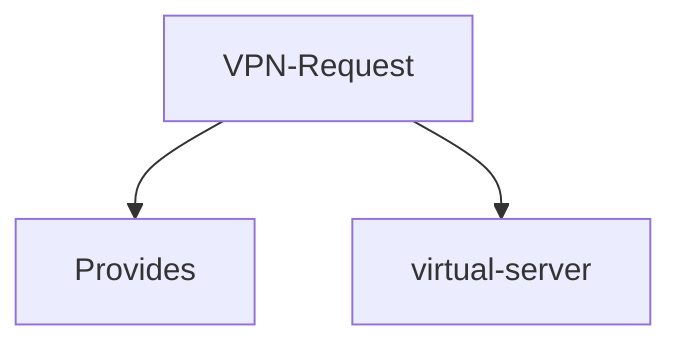

# Peernet: Decentralized VPN Service Provider
Peernet is a decentralized VPN service provider that offers fast, secure, and private internet access to users around the world.
### Decentralized Network
- Unlike traditional VPNs that rely on centralized servers, Peernet uses a network of peer-to-peer connections to create a decentralized and distributed network.
- Peernet's decentralized approach eliminates the need for a single point of control, making it less vulnerable to hacking, censorship, or data breaches.
- with `super fluid` we have made the billing of the VPN service very easy , you only pay for what you use !🥳
### Privacy and Security
- Peernet encrypts users' internet traffic and hides their IP addresses, providing complete privacy and anonymity.
- Peernet enables users to access geo-restricted content and circumvent internet censorship, providing unrestricted access to the internet.
### Fast and Reliable Connectivity
- With Peernet, users can enjoy fast and reliable internet connectivity without sacrificing privacy or security.

# Usage Guide 🙃

`note`: To run this project, it is necessary to have either `WSL` or a `Linux operating system`
### Requirements
[windscribe](https://windscribe.com/guides/linux)

### Steps 
 - open the [peernet](https://peernet.vercel.app/) website
 - login using arcana auth 
 - set the bandwidth 
 - turn the vpn on 
 - `note` : VPN works only under two conditions
  ```
  * when there are providers 
  * when there are no providers , we run a temporary virtual server to manage the traffic
 ```

